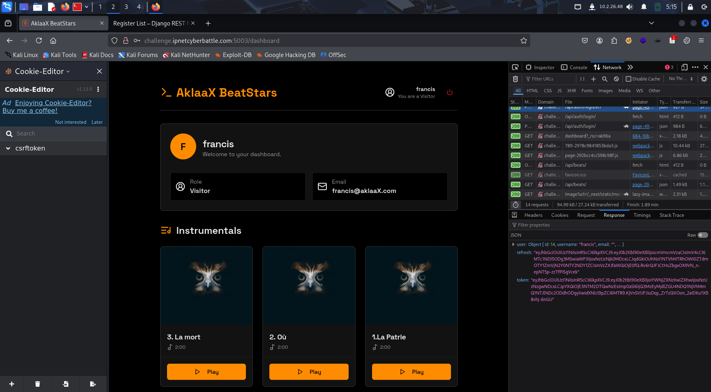
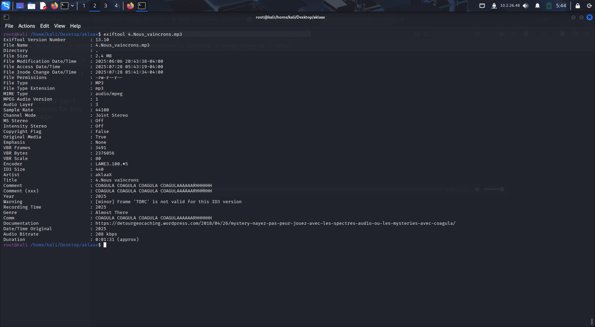

# AklaaX Writeup
## Reconnaissance
- **Nmap Scan**:
    ```bash
    nmap -sC -sV -oN challenge.ipnetcyberbattle.com
    ```
    here are the results:
    

- **Port 22**: OpenSSH 7.9p1 Debian 10+deb10u2
- **Port 80**: Apache httpd 2.4.38 (Debian)
- **Port 443**: Apache httpd 2.4.38 (Debian)
I head to the web server on port 5003 and find a simple webpage with a link to a login page.
As stated in the challenge description, I need to register an account to proceed. I click on the link and am redirected to a registration page.
## Registration
I fill out the registration form with the following details.

A tiny error message appears, indicating that the minimum password length is 8 characters. I try again with a longer password.
Now after it working I head back to the login page and enter my credentials.

## Dashboard
After successfully logging in, I am redirected to the dashboard. which is a simple page showcasing the beatmaker release beats.

I found out something interesting about the name of the song, it reminder me of a great African personality, According to the research I did, The name was inspired by Thomas Sankara motto, he was modernizing Burkina Faso in the 1980s, promoting self-sufficiency and anti-imperialism.
But found out that the full phrase was "La patrie ou la mort, nous vaincrons" which means "The homeland or death, we will win". This is a powerful statement of resilience and determination.

On the dashboard, I could just found "La patrie ou la mort," when assembling the beat's name in order.
For me it's was a hint to the next step. There is a hidden beat, with the reste of the name : "nous vaincrons"
## WEB recon
I start by examining the web application for any potential vulnerabilities or hidden features. In my local storage, I notice a access token, refresh token and userinfo stored in the browser.

I also notice that the web application uses a JWT (JSON Web Token) for authentication. I can decode the JWT to see its contents.

After that, I tried to edit the token, then insert it back into the local storage, and it did work. The goal was to either change the user role to admin or either change the id to 1, and still change the role to admin. because in some web applications, the admin user has an id of 1, if the id are incremental.

After that, I refresh the page and i can see that a new beat has appeared in the dashboard, with a label "draft". Here is the name : 4. Nous vaincrons.

## Hidden Beat : steganography
I downloaded the beat, and tried some tools: like strings, binwalk, and then exiftool. i was greated with a message in the metadata of the file.

I found a web page in the Documentation cestion of the metadata, which is a link to a webpage containing info about how to hide messages in audio files.
I followed the link and found a page that explains how to hide messages in audio files using a technique called "steganography". The page provides a detailed explanation of how to use this technique to hide messages in audio files, with a tool like sonic visualiser to uncover the hidden message.

Then I downloaded the tool and opened the beat file in it, and followed the instructions. I was able to see the hidden message in the audio file.


You see the hidden message in the audio file, which is a flag.
## Flag
Redacted flag: 
